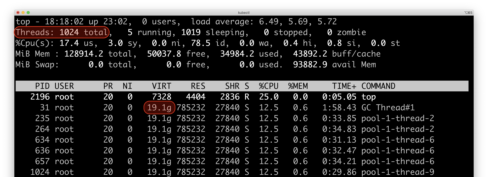

# fibers-server

`fibers-server` is an evaluation server based on [Jetty](https://www.eclipse.org/jetty) for lightweight threads (fibers) provided by [Project Loom](https://wiki.openjdk.java.net/display/loom/Main)
Early-Access [builds](https://jdk.java.net/loom/). The server provides a sync and an async servlet handlers that can be configured to serve requests including more or less CPU, IO and sleep.
For comparison, the server can be started with a thread factory backed by kernel or lightweight threads (fibers).


# Setup

Setup Project Loom early-access build by following the [instructions](https://jdk.java.net/loom/).

```
$ java -version
openjdk version "16-loom" 2021-03-16
OpenJDK Runtime Environment (build 16-loom+4-56)
OpenJDK 64-Bit Server VM (build 16-loom+4-56, mixed mode, sharing)
```

# Build

```
mvn clean:install
```

# Run

Print help usage via

```
docker run -p 8080:8080 -i tmaretdotio/fibers-server:0.0.2 -h
```

Run a server using kernel threads and unbounded pool

```
docker run -p 8080:8080 -i tmaretdotio/fibers-server:0.0.2 -t kernel
```

Run the server using lightweight threads (fibers) and unbounded pool

```
docker run -p 8080:8080 -i tmaretdotio/fibers-server:0.0.2 -t fibers
```

Run the server with bounded pool (400) and lightweight threads

```
docker run -p 8080:8080 -i tmaretdotio/fibers-server:0.0.2 -t fibers -c 400
```

# Use

Request served by a sync servlet

```
curl http://localhost:8080/sync
```

Request served by an async servlet

```
curl http://localhost:8080/async
```

Specify the amount of work performed by the servlet before returning the response.

```
curl 'http://localhost:8080/sync?cpuIterations=10000&idleDelay=0&fileLength=100000'
```

| Request Parameter | Definition |
| :---------------: | ---------- |
| `cpuIterations`   | The number of SHA256 iterations on a 256 byte array. Default is 10'000 iterations and corresponds to ~ 3ms on a 2.3 GHz Intel Core i9. |
| `idleDelay`       | The time to sleep in ms. Default is 0ms. |
| `fileLength`      | The length in bytes of the file returned. The file is auto-generated and served from disk. Default length is 100KB.|

# Benchmark

The following table summarises the `fibers-server` throughput under load.
The server and the [wrk2](https://github.com/giltene/wrk2) traffic generator were
deployed as two containers inside a single Kubernetes Pod and thus shared their network
interface. The server was allocated 4 cpu and 3G memory limits.

The fibers throughputs were obtained with an unbounded pool. The kernel thread values were obtained with a pool of capacity 1000.

## Experiment #1

The request handling time is mostly idle. It consists of 80% sleep, 15% IO and 5% CPU. The raw results are [here](./benchmark/experiment-1).

### Throughput for 10ms requests

cpuIterations=1000
idleDelay=8
fileLength=1000

|Concurrency (threads)|fibers req/s|kernel req/s|
|---------------------|------------|------------|
|100                  |3411        |2183        |
|250                  |3272        |2150        |
|500                  |3350        |2012        |
|1000                 |3187        |1828        |
|2000                 |3265        |1863        |
|4000                 |3055        |1839        |


### Throughput for 100ms requests

cpuIterations=10000
idleDelay=70
fileLength=10000

|Concurrency (threads)|fibers req/s|kernel req/s|
|---------------------|------------|------------|
|100                  |330         |256         |
|250                  |316         |248         |
|500                  |334         |240         |
|1000                 |323         |186         |
|2000                 |322         |173         |
|4000                 |325         |177         |


### Throughput for 1s requests

cpuIterations=100000
idleDelay=700
fileLength=100000

The N/A values indicates the test could not complete.

|Concurrency (threads)|fibers req/s|kernel req/s|
|---------------------|------------|------------|
|100                  |31          |24          |
|250                  |30          |19          |
|500                  |30          |13          |
|1000                 |31          |N/A         |
|2000                 |32          |N/A         |
|4000                 |29          |N/A         |


## Experiment #2

The request handling time is mostly idle. It consists of 95% sleep, 4.5% IO and 0.4% CPU. The raw results are [here](./benchmark/experiment-2).

### Throughput for 10ms requests

cpuIterations=133
idleDelay=9
fileLength=1000

|Concurrency (threads)|fibers req/s|kernel req/s|
|---------------------|------------|------------|
|100                  |9723        |9193        |
|250                  |13735       |10047       |
|500                  |13942       |9683        |
|1000                 |13754       |9355        |
|2000                 |14350       |10190       |
|4000                 |12973       |10045       |


### Throughput for 100ms requests

cpuIterations=1330
idleDelay=95
fileLength=10000

|Concurrency (threads)|fibers req/s|kernel req/s|
|---------------------|------------|------------|
|100                  |1012        |1025        |
|250                  |1925        |1850        |
|500                  |1944        |1797        |
|1000                 |1953        |1523        |
|2000                 |1871        |1623        |
|4000                 |1918        |1570        |


### Throughput for 1s requests

cpuIterations=13300
idleDelay=960
fileLength=100000

|Concurrency (threads)|fibers req/s|kernel req/s|
|---------------------|------------|------------|
|100                  |100         |99          |
|250                  |206         |197         |
|500                  |206         |221         |
|1000                 |198         |175         |
|2000                 |199         |173         |
|4000                 |198         |169         |


## Monitoring resources

Using `top` while benchmarking the server with 4000 concurrency shows ~ 1000 kernel threads for the kernel mode (the size of the thread pool)



and ~ 10 kernel threads for the fibers mode


