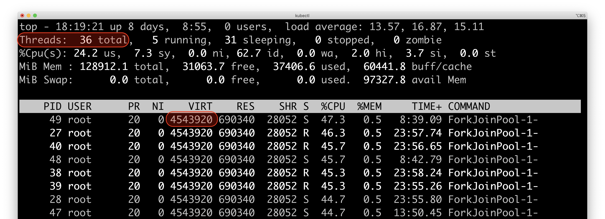

# fibers-server

`fibers-server` is an evaluation server based on [Jetty](https://www.eclipse.org/jetty) for virtual threads (fibers) provided by [Project Loom](https://wiki.openjdk.java.net/display/loom/Main)
Early-Access [builds](https://jdk.java.net/loom/). The server provides a sync and an async servlet handlers that can be configured to serve requests including more or less waiting (IO and idle) and service time (CPU). The server can be started with a queued or unbounded thread pool. Both pools can be backed by virtual or kernel threads.


# Setup

Setup Project Loom early-access build by following the [instructions](https://jdk.java.net/loom/).

```
$ java -version
openjdk version "16-loom" 2021-03-16
OpenJDK Runtime Environment (build 16-loom+4-56)
OpenJDK 64-Bit Server VM (build 16-loom+4-56, mixed mode, sharing)
```

# Build

```
mvn clean:install
```

# Run

Print help usage via

```
docker run -p 8080:8080 -i tmaretdotio/fibers-server:0.0.2 -h
```

Run a server using kernel threads and unbounded pool

```
docker run -p 8080:8080 -i tmaretdotio/fibers-server:0.0.2 -t kernel
```

Run the server using lightweight threads (fibers) and unbounded pool

```
docker run -p 8080:8080 -i tmaretdotio/fibers-server:0.0.2 -t fibers
```

Run the server with bounded pool (400) and lightweight threads

```
docker run -p 8080:8080 -i tmaretdotio/fibers-server:0.0.2 -t fibers -c 400
```

# Use

Request served by a sync servlet

```
curl http://localhost:8080/sync
```

Request served by an async servlet

```
curl http://localhost:8080/async
```

Specify the amount of work performed by the servlet before returning the response.

```
curl 'http://localhost:8080/sync?cpuIterations=10000&idleDelay=0&fileLength=100000'
```

| Request Parameter | Definition |
| :---------------: | ---------- |
| `cpuIterations`   | The number of SHA256 iterations on a 256 byte array. Default is 10'000 iterations and corresponds to ~ 3ms on a 2.3 GHz Intel Core i9. |
| `idleDelay`       | The time to sleep in ms. Default is 0ms. |
| `fileLength`      | The length in bytes of the file returned. The file is auto-generated and served from disk. Default length is 100KB.|

# Benchmark

The following table summarises the `fibers-server` throughput under load generated by [wrk2](https://github.com/giltene/wrk2).

Throughputs values labeled `fibers` refer to the `fibers-server` running with an unbounded pool of virtual threads.

Throughput values labeled `kernel` refer to the `fibers-server` running with a queued pool of 1000 kernel threads.


## Experiment #1 — 95% waiting time local sync servlet

Workload consists of 80% sleep, 15% IO and 5% CPU. The raw results are [here](./benchmark/experiment-1).

The server and load generator are deployed as two containers inside a single Kubernetes Pod communicating via localhost on the shared network interface.

The load generator was allocated 8 cores and 16GB memory.
The server was allocated 4 cores and 3GB memory. :hand: The server %CPU topped 400% for higher concurrency and was thus limiting the throughput.

### Throughput for 10ms requests

|Concurrency (threads)|fibers req/s|kernel req/s|
|---------------------|------------|------------|
|100                  |3411        |2183        |
|250                  |3272        |2150        |
|500                  |3350        |2012        |
|1000                 |3187        |1828        |
|2000                 |3265        |1863        |
|4000                 |3055        |1839        |


### Throughput for 100ms requests

|Concurrency (threads)|fibers req/s|kernel req/s|
|---------------------|------------|------------|
|100                  |330         |256         |
|250                  |316         |248         |
|500                  |334         |240         |
|1000                 |323         |186         |
|2000                 |322         |173         |
|4000                 |325         |177         |


### Throughput for 1s requests

The N/A values indicates the test could not complete.

|Concurrency (threads)|fibers req/s|kernel req/s|
|---------------------|------------|------------|
|100                  |31          |24          |
|250                  |30          |19          |
|500                  |30          |13          |
|1000                 |31          |N/A         |
|2000                 |32          |N/A         |
|4000                 |29          |N/A         |


## Experiment #2 — 99% waiting time local sync servlet

Workload consists of 95% sleep, 4% IO and 1% CPU. The raw results are [here](./benchmark/experiment-2).

The server and load generator are deployed as two containers inside a single Kubernetes Pod communicating via localhost on the shared network interface.

The load generator was allocated 8 cores and 16GB memory.
The server was allocated 4 cores and 3GB memory. :hand: The server %CPU topped 400% for higher concurrency and was thus limiting the throughput.

### Throughput for 10ms requests

|Concurrency (threads)|fibers req/s|kernel req/s|
|---------------------|------------|------------|
|100                  |9723        |9193        |
|250                  |13735       |10047       |
|500                  |13942       |9683        |
|1000                 |13754       |9355        |
|2000                 |14350       |10190       |
|4000                 |12973       |10045       |


### Throughput for 100ms requests

|Concurrency (threads)|fibers req/s|kernel req/s|
|---------------------|------------|------------|
|100                  |1012        |1025        |
|250                  |1925        |1850        |
|500                  |1944        |1797        |
|1000                 |1953        |1523        |
|2000                 |1871        |1623        |
|4000                 |1918        |1570        |


### Throughput for 1s requests

|Concurrency (threads)|fibers req/s|kernel req/s|
|---------------------|------------|------------|
|100                  |100         |99          |
|250                  |206         |197         |
|500                  |206         |221         |
|1000                 |198         |175         |
|2000                 |199         |173         |
|4000                 |198         |169         |


## Experiment #3 — 99% waiting time remote sync servlet

Workload consists of 95% sleep, 4% IO and 1% CPU. The raw results are [here](./benchmark/experiment-3).

The server and load generator are deployed as two Kubernetes Pods communicating using Kubernetes [cluster routing](https://kubernetes.io/docs/concepts/cluster-administration/networking).

The load generator was allocated 8 cores and 16GB memory.
The server was allocated 4 cores and 3GB memory. :hand: The server %CPU topped 400% for higher concurrency and was thus limiting the throughput.

### Throughput for 10ms requests

|Concurrency (threads)|fibers req/s|kernel req/s|
|---------------------|------------|------------|
|100                  |9633        |9214        |
|250                  |14181       |9444        |
|500                  |14618       |9007        |
|1000                 |13372       |8415        |
|2000                 |13406       |9485        |
|4000                 |12574       |9643        |


### Throughput for 100ms requests

|Concurrency (threads)|fibers req/s|kernel req/s|
|---------------------|------------|------------|
|100                  |1027        |1022        |
|250                  |1980        |1663        |
|500                  |1973        |1592        |
|1000                 |1938        |1530        |
|2000                 |1885        |1554        |
|4000                 |2056        |1577        |


### Throughput for 1s requests

|Concurrency (threads)|fibers req/s|kernel req/s|
|---------------------|------------|------------|
|100                  |100         |97          |
|250                  |202         |172         |
|500                  |206         |176         |
|1000                 |203         |156         |
|2000                 |197         |151         |
|4000                 |212         |168         |


### Throughput for 10s requests

The N/A values indicates the test could not complete.

|Concurrency (threads)|fibers req/s|kernel req/s|
|---------------------|------------|------------|
|100                  |8           |4           |
|250                  |12          |10          |
|500                  |8           |0           |
|1000                 |11          |N/A         |
|2000                 |10          |N/A         |
|4000                 |11          |N/A         |


## Experiment #4 — 99.5% waiting time remote sync servlet

Workload consists of 95.5% sleep, 4% IO and 0.5% CPU. The raw results are [here](./benchmark/experiment-4).

The server and load generator are deployed as two Kubernetes Pods communicating using Kubernetes [cluster routing](https://kubernetes.io/docs/concepts/cluster-administration/networking).

The load generator was allocated 8 cores and 16GB memory.
The server was allocated 8 cores and 3GB memory.

:+1: Throughput was _not_ limited by server 8 cores. %CPU usage remained < 800% during the test.

### Throughput for 10ms requests

|Concurrency (threads)|fibers req/s|kernel req/s|
|---------------------|------------|------------|
|100                  |10262       |10342       |
|250                  |25468       |24383       |
|500                  |32888       |24898       |
|1000                 |34615       |24300       |
|2000                 |34818       |25245       |
|4000                 |35678       |24589       |
|8000                 |36942       |29906       |


### Throughput for 100ms requests

|Concurrency (threads)|fibers req/s|kernel req/s|
|---------------------|------------|------------|
|100                  |1006        |1008        |
|250                  |2523        |2515        |
|500                  |4926        |4683        |
|1000                 |5387        |4423        |
|2000                 |5384        |4551        |
|4000                 |5355        |4336        |
|8000                 |6235        |4923        |


## Monitoring resources

Using `top` while benchmarking the server with 4000 concurrency shows ~ 1000 kernel threads to support the `kernel` server mode


and ~ 10 kernel threads to support the `fibers` server mode


